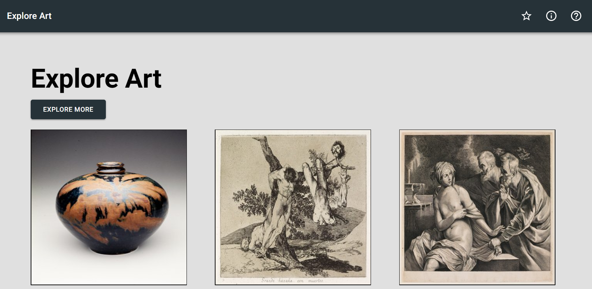
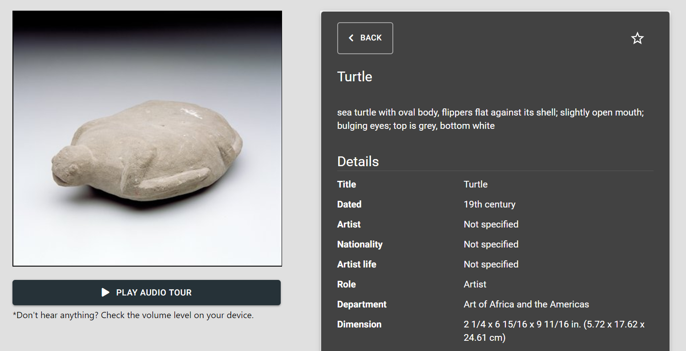
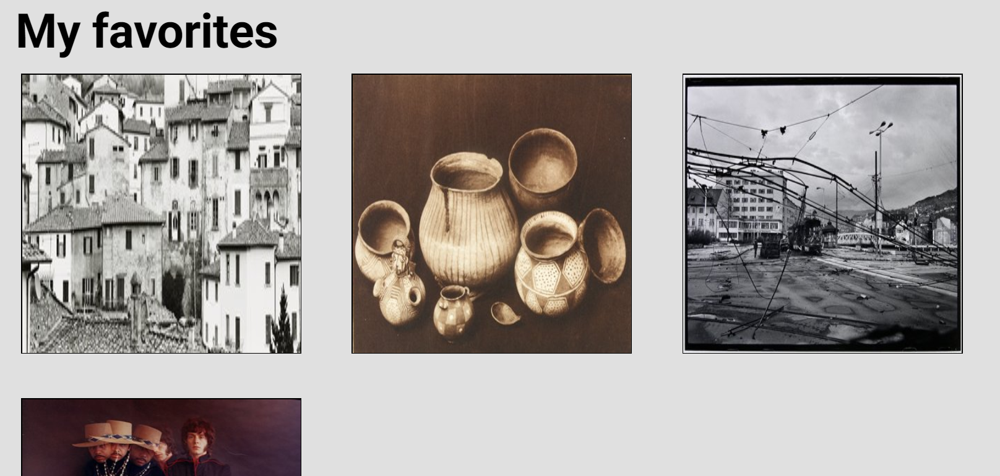
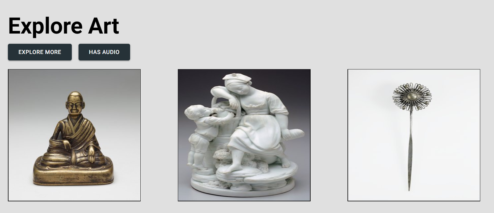
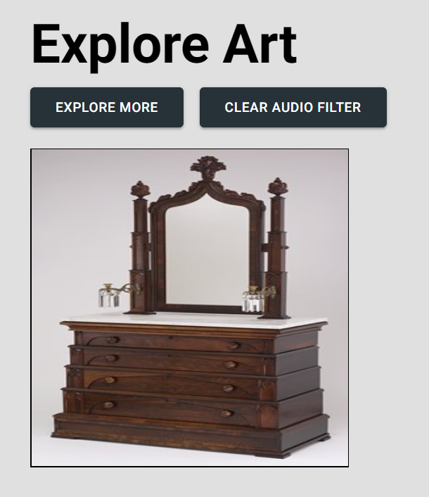
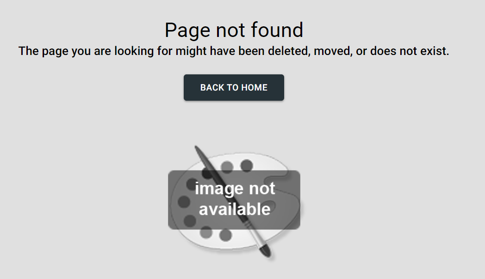

# Explore Art

## Table of contents

* [Live](#live)
* [Screenshots](#screenshots)
* [About this project](#about-this-project)
  * [How the app is built](#how-the-app-is-built)
  * [App workflow](#workflow)
  * [Structure of the project](#project-structure)
* [Getting started](#getting-started)
* [Deploying the app](#deployment)
* [Technologies used to create the app](#technologies-used)
* [Direction for future development](#future)
* [Issues](#Issues)

## <a name="live"></a>Live

The app is currently live at the following URL:

## <a name="screenshots"></a> Screenshots

### Landing/Explore Art Page



### Art Details page



### Favorites page



### Filter by Audio





### 404 page



## <a name="about-this-project"></a> About this project

### <a name="how-the-app-is-built"></a> How the app is built

This project is built using React, which is an open source JavaScript library developed at Facebook specifically for the task of developing user interfaces. React relies on a component-based architecture where elements of the user interface are broken into small chunks of code called components. To design and build the user interface, I used the Material UI library, which is a 3rd party UI library of React component's that mimic Google's Material Design specification. I used Material UI for styling, theming, and incorporating cool components. As to the grid/layout system I used, I went with Flexbox, making it easy to design for mobile, tablet, and desktop screens.

This project also uses art data from the Minneapolis Institute of Art's ElasticSearch API. To be able to store and handle the art data that comes back from the API, I decided to to use Jake Archibald's [IndexedDB Promised](https://github.com/jakearchibald/idb) library, which is similar to the IndexedDB API, but uses promises instead of events. IndexedDB is basically a noSQL storage option that allows the data that comes back from the API response to be stored in the user's browser. Most browsers do support this option, making data storage and retrieval very efficient. For a list of browsers that support IndexedDB, go [here](https://caniuse.com/#search=indexeddb). 

IndexedDB, similar to local storage, allows the app to cache the API response data in the user's browser and eliminate/minimize the need to make unneccessary GET requests to the API. In fact, the only time a GET request to the API is actually made is if the user is a new user and has no artwork currently stored in their IndexedDB store or if the user clicks the <b>Explore More</b> button on the landing page to intentionally get more artwork. The Fetch API is used to make the request to the ElasticSearch API.

### <a name="workflow"></a> App workflow

#### Explore Art

When a user visits the app for the first time, they will be taken to the Explore Art landing page. For first time users, a GET request is made to the ElasticSearch API using Fetch to get 10 random pieces of art and display them on the page. After the initial GET request to the API is made, the artwork retrieved from the API is then stored in the user's browser in an IndexedDB store. So, the next time the user visits the app, the app will retrieve the artwork from the IndexedDB store rather than making another request.

On the landing page, I decided to only show 10 pieces of art to the user initially. However, I decided to store more than 10 in the user's IndexedDB store. At the bottom of the landing page, I included a <b>Load More</b> button. Clicking this button will retrieve 4 more artworks from IndexedDB and display them on the landing page.

If the user browses through all of the artwork that is stored in their IndexedDB store, they have the option to get more random artwork from the ElasticSearch API by clicking the <b>Explore More</b> button. Clicking the <b>Explore More</b> button will clear the current artwork stored in the user's IndexedDB store (if the artwork has not been favorited by the user), make another GET request to the API, retrieve the new artwork from the API, and add to IndexedDB to make it available to the user.

#### View Art Details

From the Explore Art landing page, you can click on the art image to learn more about that particular piece of art. Clicking on a piece of art will take you to a separate art details page that includes an image of the artwork and information about that artwork, such as title, artist, artist life, medium, country, nationality, and more. The information about the artwork on the art details page also still comes from the IndexedDB store.

#### Listen to Art Audio (if available)

Some artworks do have audio that you can listen to. If one or more of the artworks stored in the IndexedDB store has an audio file, the <b>Has Audio</b> button will appear on the Explore Art landing page. Clicking this button will filter the art to only list the art that has audio. You can play the audio tour for a particular artwork from the art details page. To be able to play the audio within the app, I used [react-sound](https://github.com/leoasis/react-sound).

#### Favorite art

From the art details page, you can also favorite an artwork that you really like so that you can view and access it quickly later on. Clicking the star icon on the art details page saves the artwork to a separate store from the random artwork store in IndexedDB so that the favorited art doesn't get deleted when another GET request to the API is made.

#### View favorites at later time

To view your favorites, click the star icon in the top navigation bar at the top right corner of the screen. The favorites page has a similar look and feel to the Explore Art landing page. You can click on a particular artwork to view the art details again.

### <a name="project-structure"></a> Structure of the project

After you clone the repository from GitHub, you can navigate to the project root directory (tcsw-sheltrus). The project directory structure will be set up as follows:

* <b>client</b>: This folder is where all the client-side code/React app lives.
  * <b>public</b>: The public folder contains the main index.html file. This HTML file is a template. The file is empty. So, if you open it directly in a browser, you will get an empty page. Rather than placing the HTML code directly in index.html, this site uses a React component-based architecture to create, build, and render UI components to the page.
  * <b>src</b>: The src folder is where the React components reside.
    * <b>App.js</b>: The App.js file is where the components are imported and rendered, such as the top navigation bar, footer, and various pages.
    * <b>index.js</b>: The index.js file is the top level file of the React app. In index.js, the App.js file is imported, and the ReactDOM.render method is used to render App.js to the page.
    * <b>components</b>: The Components folder is where the components that are reused across the site are located. Each file represents a separate component. For example, Button.js is the button component that can be reused across the entire app for a consistent look and feel for each button.
    * <b>containers</b>: Holds all the pages of the app and the child components within those pages. For example, inside of the containers folder, there is a Profile folder. The Profile folder contains a top-level parent container/page called Profile.js
    * <b>App.css</b> and <b>index.css</b>: The external css stylesheets for the app.
    * <b>firebase-config.js</b>: contains the Firebase initialization code to connect the app to Firebase.
    * <b>sheltr-b2.svg</b>: This is the svg version of the app logo.
  * <b>.eslintrc.json</b>: List of rules and their definitions for ESLint.
  * <b>.gitignore</b>: Anything listed inside this file (for example, node_modules) will not be tracked by GitHub when code is committed.
  * <b>package.json</b>: Lists the project dependencies for the client and their version numbers.
  * <b>README.md</b>: The README file that came with setting up a create-react-app project.
  * <b>yarn.lock</b>: Dependency tree for the project. Lists all the client dependencies and their versions.
* <b>functions</b>: Folder for storing Firebase cloud functions. Currently not in use for anything.
* <b>readme_images</b>: Images used in the project README file.
* <b>.firebaserc</b>: Hidden file that allows you to quickly switch between projects with 'firebase use'.
* <b>.gitignore</b>: Anything listed inside this file (for example, node_modules) will not be tracked by GitHub when code is committed.
* <b>firebase.json</b>: Firebase configuration file required to deploy the app to Firebase.
* <b>package.json</b>: Lists the project dependencies and their version numbers.
* <b>yarn.lock</b>: Dependency tree for the project. Lists the project dependencies and their versions.
* <b>server.js</b>: Contains the code to set up express and make a post request using the Twilio API to create a voice messaging system.
* <b>README.md</b>: The README file that contains important information about this project.
* <b>make-call.js</b>: Contains the JavaScript code to make a phone call using the Twilio API.

## <a name="getting-started"></a> Getting started

The following section will take you through the steps of setting up this app and getting it running locally on your computer.

If you don't want to set up this project locally and just want to see the deployed app, go to TBD.

To set up this app locally on your computer, perform the following steps:

  1. [Clone the repository](#clone-repository)
  2. [Install Node.js](#install-node)
  3. [Install yarn](#install-yarn)
  4. [Install the project dependencies](#dependencies)
  5. [Start the React development server](#start-server)

###  <a name="clone-repository"></a> 1. Clone the repository
The first step is to clone the project repository to a local directory on your computer. To clone the repository:

1. Go to <https://github.com/philipstubbs13/pollywog-challenge/tree/phil_react_code> to get the latest code from the phil_react_code branch.

2. Run the following commands:

```bash
git clone https://github.com/philipstubbs13/pollywog-challenge.git
cd ./pollywog-challenge
```

###  <a name="install-node"></a> 2. Install Node.js

If you don't already have Node.js installed on your computer, you can install the latest version [here](https://nodejs.org/en/).

Troubleshooting tip: If you have difficulty starting the app locally, I used node v8.11.3 when testing these instructions.

### <a name="install-yarn"></a> 3. Install yarn

To be able to install the dependencies and start the app locally, you will need to install yarn. Yarn is a package manager like npm.

To install yarn globally, run the following command:

```bash
npm install -g yarn
```

For more information about yarn and other installation options, see the yarn documentation: <https://yarnpkg.com/en/>.

Troubleshooting tip: If you have difficulty starting the app locally, I used yarn v1.7.0 when testing these instructions.

### <a name="dependencies"></a> 4. Install the project dependencies

Change directory into the project root directory (root directory name should be <b>pollywog-challenge</b>) and run the following command to install the required dependencies:

```bash
yarn install
```

The following packages are dependencies to the project.

* [@material-ui/core](https://www.npmjs.com/package/@material-ui/core)
  * This is a third party design library of React components that implement Google's Material Design.
* [@material-ui/icons](https://www.npmjs.com/package/@material-ui/icons)
  * This is a library of Material Design icons.
* [classnames](https://www.npmjs.com/package/classnames)
  * This allows for conditionally joining classNames together.
* [idb](https://github.com/jakearchibald/idb#readme)
  * This is a tiny library that mirrors IndexedDB, but replaces the weird IDBRequest objects with promises,
  plus a couple of other small changes. This allows the app to store response data in IndexedDB in the user's browser to limit the number of requests to the Elasticsearch API.
* [prop-types](https://www.npmjs.com/package/prop-types)
  * This is used to document and validate the different properties passed to a component.
* [react](https://www.npmjs.com/package/react)
  * This package contains the functionality necessary to define React components.
* [react-dom](https://www.npmjs.com/package/react-dom)
  * This serves as the entry point of the DOM-related rendering paths
* [react-router-dom](https://www.npmjs.com/package/react-router-dom)
  * This is a third party routing library use to connect and link different components across the app.
* [react-scripts](https://www.npmjs.com/package/react-scripts)
  * This includes scripts and configuration used by Create React App.
* [react-sound](https://github.com/leoasis/react-sound)
  * This allows us to play the related audio files that come with some of the artwork within the app.
* [uuid](https://www.npmjs.com/package/uuid)
  * This is used to generate a random id for using as a key to store the application state in IndexedDB in the user's browser.

This project also uses ESLint and the Airbnb JavaScript style guide to help maintain code quality. ESLint includes the following dev dependencies:

* babel-eslint
* eslint
* eslint-config-airbnb
* eslint-plugin-import
* eslint-plugin-jsx-a11y
* eslint-plugin-react

For more information on the Airbnb style guide, go [here](https://github.com/airbnb/javascript).

Version information for each of these packages is available in the <b>package.json</b> file in the project root directory (<b>pollywog-challenge</b>).

###  <a name="start-server"></a> 5. Start the React development server.

After performing all of the setup steps in the <b>Getting started</b> section, navigate to the project root directory (<b>pollywog-challenge</b>) and run the following command to start the React development server:

```bash
yarn start
```

After the development server has started, a browser window should open, and you should see the app. If the browser does not automatically open after the server starts, you can verify that the app is working locally on your computer by opening the browser and going to [http://localhost:3000](http://localhost:3000). Note that by default, the development server will try to start up on port 3000. If port 3000 is already in use on your computer, then you might be asked if you want to use a different port.

## <a name="deployment"></a> Deploying the app

This site is deployed to Firebase using Firebase Hosting. For more information on hosting with Firebase, see [Firebase Hosting](https://firebase.google.com/docs/hosting/). To deploy the app, you will need to build a production version of the app as well as have the Firebase CLI installed.

1. If not already installed, install the Firebase CLI globally by running the following command:

```bash
npm install -g firebase-tools
```

This installs the firebase command globally. To update to the latest version, simply re-run the same command.

2. To connect your local machine to your Firebase account and obtain access to the Firebase project, run the following command:

```bash
firebase login
```

3. Change directory to the <b>pollywog-challenge</b> directory.

4. If you have deployed the app before, there will be a build directory inside here. Delete the existing <b>build</b> directory.

5. Run the following command to build a clean, production version of the app.

```bash
yarn build
```
This command creates a directory called <b>build</b> inside of the project root directory.

6. Commit changes to git (if not done already).

7. Run the following command to deploy your changes:

```bash
firebase deploy
```

This command deploys the project to TBD on firebase.

## <a name="technologies-used"></a> Technologies used to create app

* HTML5
* CSS
* Javascript (ES6)
* [React](https://reactjs.org/)
* [Material UI](https://material-ui.com/)
* [IndexedDB Promised](https://github.com/jakearchibald/idb#readme) - Used for storing application state to eliminate unnecessary API requests/calls.
* [ESLint](https://eslint.org/)
* [ElasticSearch API](https://github.com/artsmia/collection-elasticsearch) - Used to search and find art from the Minneapolis Institute of Art collection.
* [Firebase for hosting](https://firebase.google.com/docs/hosting/)

## <a name="future"></a> Direction for future development

The following is a list of potential enhancements for future code development.

* Upgrade application store from IndexedDB to Redux.
* Add authentication workflow that allows users to sign up and login.
* Add search feature that allows users to search/query artwork using the ElasticSearch API.
* Add the ability to post a comment on a particular artwork and save that comment.

## <a name ="Issues"></a> Issues

If you find an issue while using the site or have a request, log the issue or request [here](https://github.com/philipstubbs13/pollywog-challenge/issues/). These issues will be addressed in a future code update.